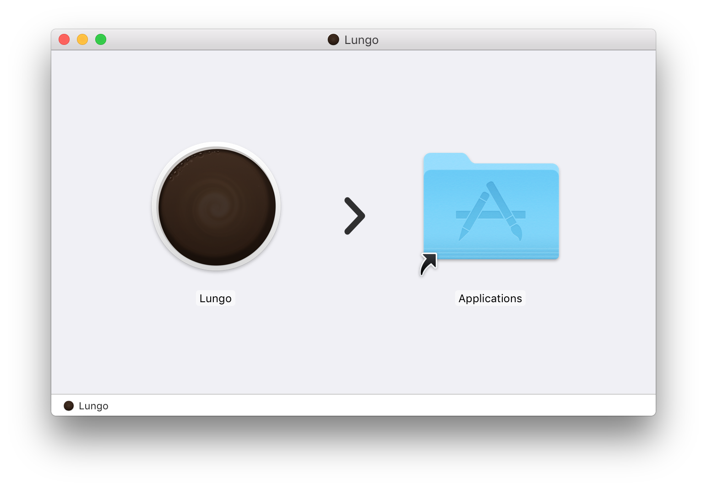
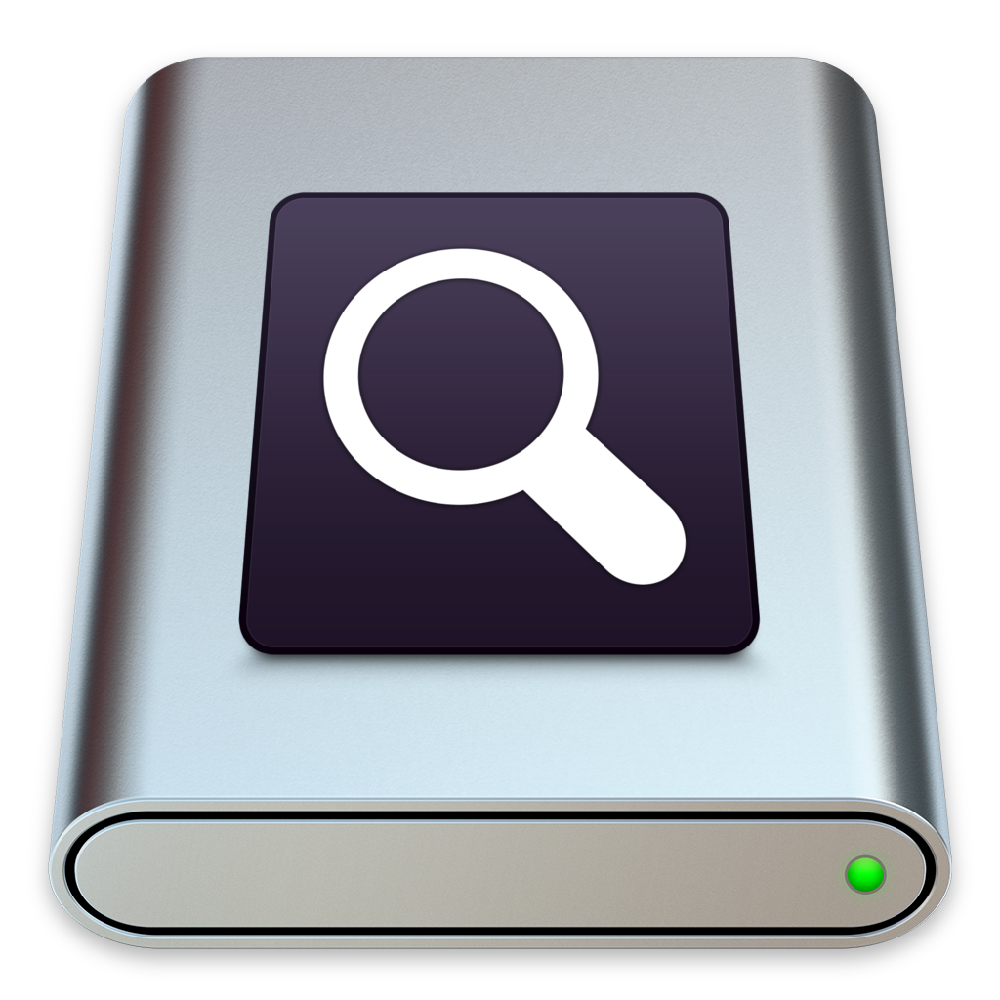

# create-dmg

> Create a good-looking [DMG](https://en.wikipedia.org/wiki/Apple_Disk_Image) for your macOS app in seconds

Imagine you have finished a macOS app, exported it from Xcode, and now want to distribute it to users. The most common way of distributing an app outside the Mac App Store is by putting it in a `.dmg` file. These are hard to create, especially good-looking ones. You can either pay for a GUI app where you have to customize an existing design or you can run some homebrewed Bash script and you still have to design it. This tool does everything for you, so you can play with your 🐈 instead.


*This tool is intentionally opinionated and simple. I'm not interested in adding lots of options.*

## Install

Ensure you have [Node.js](https://nodejs.org) 18 or later installed. Then run the following:

```sh
npm install --global create-dmg
```

## Usage

```
$ create-dmg --help

  Usage
    $ create-dmg <app> [destination]

  Options
    --overwrite          Overwrite existing DMG with the same name
    --identity=<value>   Manually set code signing identity (automatic by default)
    --dmg-title=<value>  Manually set DMG title (must be <=27 characters) [default: App name]

  Examples
    $ create-dmg 'Lungo.app'
    $ create-dmg 'Lungo.app' Build/Releases
```

## DMG

The DMG requires macOS 10.13 or later and has the filename `App Name 0.0.0.dmg`. For example, `Lungo 1.0.0.dmg`.

It will try to code sign the DMG, but the DMG is still created and fine even if the code signing fails, for example if you don't have a developer certificate.

**Important:** Don't forget to [notarize your DMG](https://stackoverflow.com/a/60800864/64949).



### Software license agreement

If either `license.txt`, `license.rtf`, or `sla.r` ([raw SLAResources file](https://download.developer.apple.com/Developer_Tools/software_licensing_for_udif/slas_for_udifs_1.0.dmg)) are present in the same directory as the app, it will be added as a software agreement when opening the image. The image will not be mounted unless the user indicates agreement with the license.

`/usr/bin/rez` (from [Command Line Tools for Xcode](https://developer.apple.com/download/more/)) must be installed.

### DMG icon

[GraphicsMagick](http://www.graphicsmagick.org) is required to create the custom DMG icon that's based on the app icon and the macOS mounted device icon.

#### Steps using [Homebrew](https://brew.sh)

```sh
brew install graphicsmagick imagemagick
```

#### Icon example

Original icon → DMG icon



## Related

- [Defaults](https://github.com/sindresorhus/Defaults) - Swifty and modern UserDefaults
- [LaunchAtLogin](https://github.com/sindresorhus/LaunchAtLogin) - Add “Launch at Login” functionality to your macOS
- [My apps](https://sindresorhus.com/apps)
- [More…](https://github.com/search?q=user%3Asindresorhus+language%3Aswift+archived%3Afalse&type=repositories)
